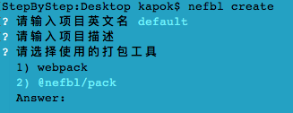

<p align='center'>
    <a href='https://nefbl.github.io/pack' target='_blank'>
        
    </a>
</p>

# Nefbl | 新一代前端框架（打包工具）

<p>
  <a href="https://hai2007.gitee.io/npm-downloads?interval=7&packages=@nefbl/pack"></a>
  <a href="https://www.npmjs.com/package/@nefbl/pack"></a>
  <a href="https://github.com/nefbl/pack/graphs/commit-activity" target='_blank'></a>
  <a href="https://github.com/nefbl/pack/blob/master/LICENSE"></a>
  <a href="https://github.com/nefbl/pack" target='_blank'></a>
</p>

## Issues
使用的时候遇到任何问题或有好的建议，请点击进入[issue](https://github.com/nefbl/pack/issues)！

## How to use?

如果你想快速试试，可以使用命令创建项目。

首先，你需要安装cli工具：

```
npm install -g @nefbl/cli
```

然后，找个地方（比如桌面）执行生成命令：

```
nefbl create
```

根据提示依次输入项目名称、描述、选择打包工具等即可。



如上截图，请在选择打包工具的时候，选择```@nefbl/pack```这一项。

最后回车，即可得到一个空的基于```@nefbl/pack```打包的项目了。

当然，如果你不想创建，也可以直接查看我们提供的[ 例子项目 example ](https://github.com/nefbl/example/tree/@nefbl/pack)哦~

具体的使用你可以[查阅文档](https://nefbl.github.io/pack)哦~

### 更多基于此打包工具的项目

- [在线H5音频编辑器](https://github.com/hai2007/audio-editor)
- [前端演示例子](https://github.com/hai2007/What-is-the-front-end)

等......

欢迎你的加入，如果希望加入我们，请去[issue](https://github.com/nefbl/pack/issues)给我们留言。

~~我们会基于此积累更多打包工具相关技术，不断丰富本项目，待时机成熟，再设计并开发一个真正通用的打包工具，如果运气不好，就止步于此吧。~~

> 鉴于各种考虑，后续本项目将不会再进行大的改造和升级，除非有必要，而对于```nefbl```的后续打包工具，官方选型同步改变为[EtcPack](https://etcpack.github.io/api/)，本项目转入维护状态。

> 非常感谢本项目开发中积累的经验和教训。

## How to debug?

命令行进入```test```文件夹，然后执行：

```
npm run debug
```

在需要调试的地方提前添加“ debugger ”语句，这和普通的web端调试一样，接着，在chrome浏览器地址栏中输入：

```
chrome://inspect/#devices
```

接着，请点击“ Open dedicated DevTools for Node ”后进入调试界面。

开源协议
---------------------------------------
[MIT](https://github.com/nefbl/pack/blob/master/LICENSE)

Copyright (c) 2021 [hai2007](https://hai2007.gitee.io/sweethome/) 走一步，再走一步。
